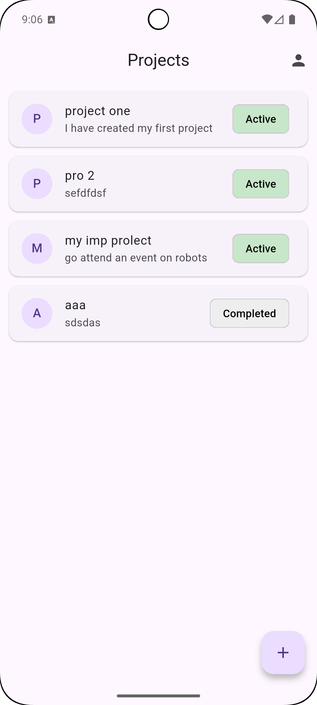
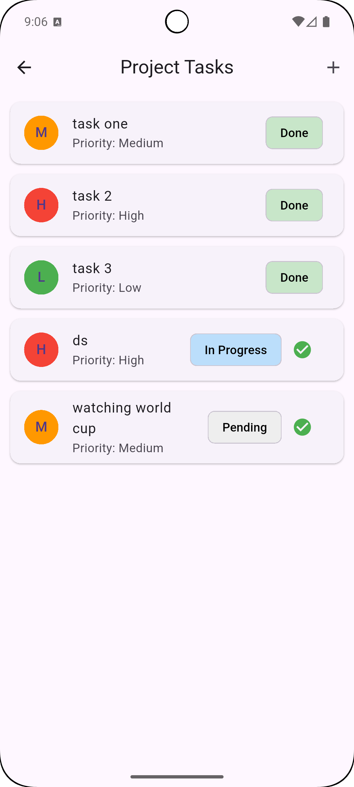
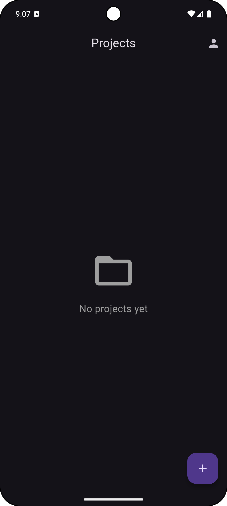
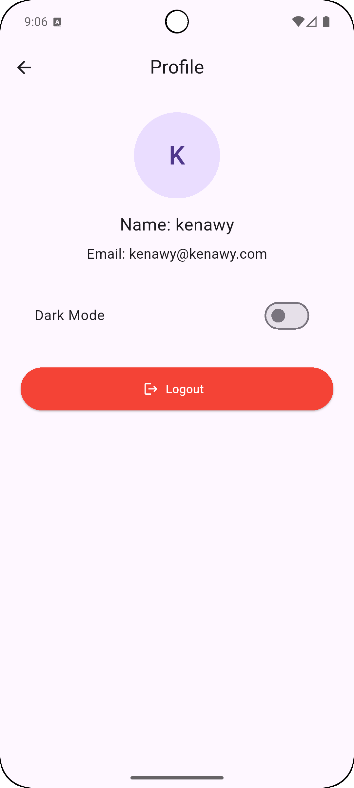
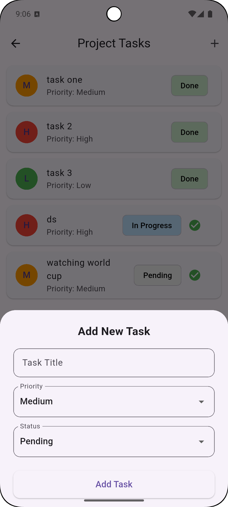

# Task Manager App

A Flutter task management app with JWT authentication, dark mode, and offline caching.

## Screenshots

| Light Mode                                      | Dark Mode                               |
|-------------------------------------------------|-----------------------------------------|
|       |  |
|  |      |
|              |    |

## Features
- Login / Register with JWT
- List projects (pull‑to‑refresh, empty state)
- Project details with tasks
- Add task (bottom sheet), mark as done
- Profile with logout
- Dark mode toggle
- Offline caching (Hive)

## Tech Stack
- Flutter, Riverpod, Dio, GoRouter, Hive, SharedPreferences
- Node.js/Express backend (in‑memory)

## Setup

### Backend
1. `cd backend && npm install`
2. `node server.js` (runs on port 5000)

### Frontend
1. Update `ApiConstants.baseUrl` to your machine's IP (for emulator use `10.0.2.2`).
2. `flutter pub get`
3. `flutter run`

## Dependencies
See `pubspec.yaml`.

## Notes
- JWT token stored in SharedPreferences.
- Offline cache uses Hive (tasks and projects stored locally).
- Architecture: Clean Architecture + MVVM with Riverpod.
